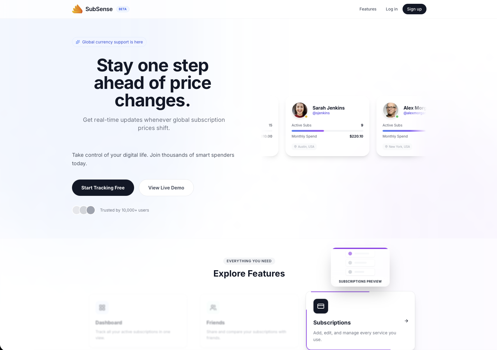
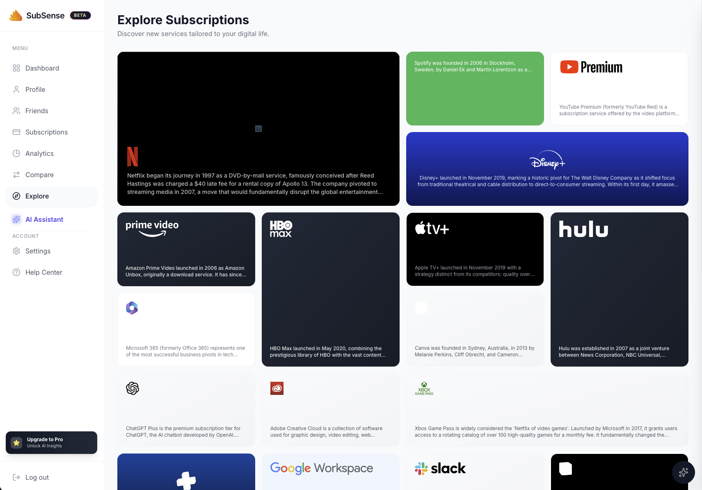
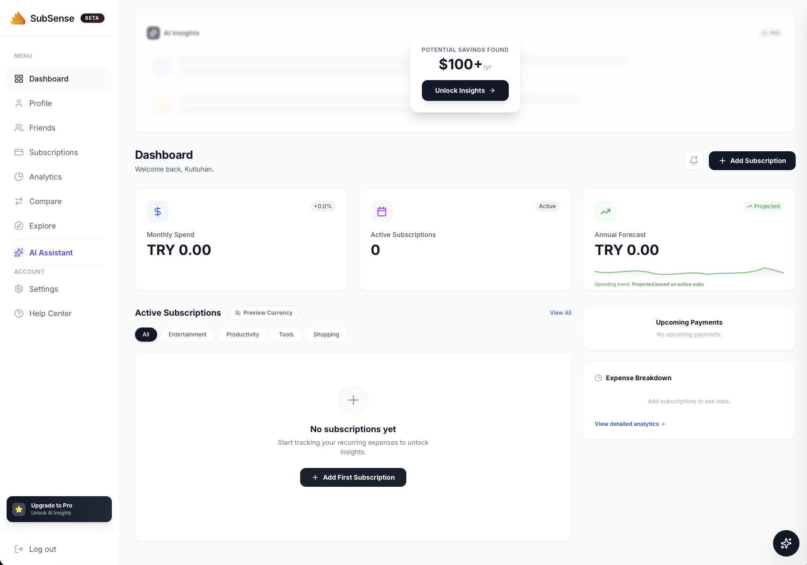
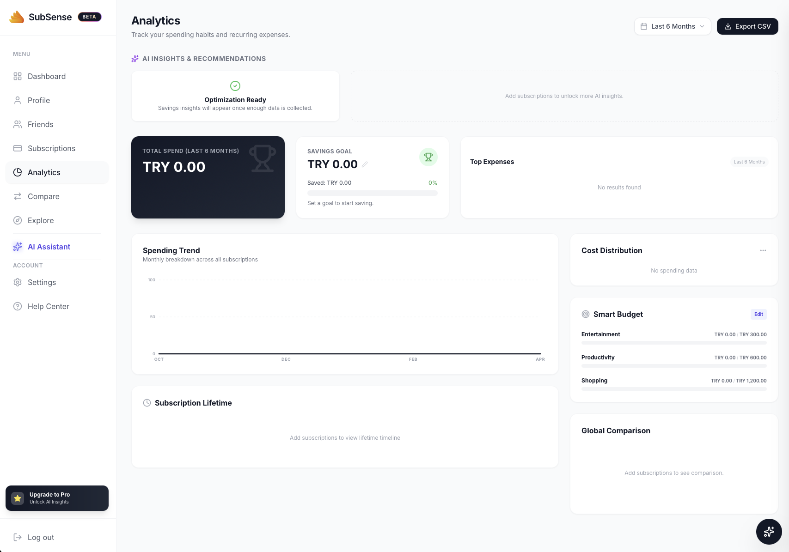

<div align="center">

<br />


<br /><br />

# SubSense

### The Intelligent Subscription Tracker

<p>
  Track every subscription. Understand your real spending.<br />
  Let AI tell you exactly where you're wasting money.
</p>

<br />

<p>
  <a href="https://sub-sense-ashy.vercel.app"><b>Live Demo</b></a>
  &nbsp;·&nbsp;
  <a href="#-quick-start">Quick Start</a>
  &nbsp;·&nbsp;
  <a href="#-features">Features</a>
  &nbsp;·&nbsp;
  <a href="#-deployment">Deployment</a>
  &nbsp;·&nbsp;
  <a href="#-roadmap">Roadmap</a>
</p>

<br />

<p>
  
  
  
  
  
</p>

<p>
  
  
  
  
</p>

<br />

</div>

---

<div align="center">

### 🇹🇷 Türkçe

**SubSense**, dijital aboneliklerinizi tek bir akıllı panelden yönetmenizi sağlayan modern bir abonelik takip uygulamasıdır. Google Gemini yapay zekası ile gereksiz harcamalarınızı tespit eder, 20'den fazla döviz birimini anlık olarak çevirir ve aboneliklerinizi global fiyatlarla karşılaştırarak size özel tasarruf fırsatları sunar. Kurulumu dakikalar içinde tamamlanır, verileriniz her zaman size aittir.

</div>

---

<br />

## 🎯 Why SubSense?

Most people have no idea how much they're actually spending on subscriptions. Trials forgotten. Prices silently raised. Services doubled up without anyone noticing. By the time you check, hundreds of dollars have quietly slipped away each month.

**SubSense fixes this with three simple promises:**

```
 1.  See every subscription in one place
 2.  Know your real total, in your own currency
 3.  Get AI-driven advice on what to cancel
```

<br />

## 📸 Screenshots

<div align="center">
  <table border="0">
    <tr>
      <td align="center" width="50%">
        
        <br /><sub><b>Landing</b> · Hero & Feature Preview</sub>
      </td>
      <td align="center" width="50%">
        
        <br /><sub><b>Explore</b> · Subscription Catalog</sub>
      </td>
    </tr>
    <tr>
      <td align="center" width="50%">
        
        <br /><sub><b>Dashboard</b> · Subscription Overview</sub>
      </td>
      <td align="center" width="50%">
        
        <br /><sub><b>Analytics</b> · Spending Breakdown</sub>
      </td>
    </tr>
  </table>
</div>

<br />

## ✨ Features

<table>
  <tr>
    <td width="50%" valign="top">
      <h3>🧠 Gemini AI Insights</h3>
      <p>Powered by Google Gemini 1.5 Flash. Detects redundant subscriptions, suggests optimizations, and estimates exact monthly savings — tailored to your real usage.</p>
    </td>
    <td width="50%" valign="top">
      <h3>🌍 20+ Currencies</h3>
      <p>Track subscriptions in any currency. Automatic conversion keeps your totals always accurate in your preferred base currency.</p>
    </td>
  </tr>
  <tr>
    <td width="50%" valign="top">
      <h3>📊 Smart Analytics</h3>
      <p>Visualize spending by category, billing cycle, and timeline. Monthly and annual breakdowns at a glance — spot trends before they become problems.</p>
    </td>
    <td width="50%" valign="top">
      <h3>🔍 Global Price Compare</h3>
      <p>Compare your prices against global averages and regional pricing for top services. Know if you're overpaying — and by exactly how much.</p>
    </td>
  </tr>
  <tr>
    <td width="50%" valign="top">
      <h3>🔔 Budget Alerts</h3>
      <p>Set monthly spending limits and get notified before you hit them. Never get blindsided by unexpected charges again.</p>
    </td>
    <td width="50%" valign="top">
      <h3>🧭 Explore Catalog</h3>
      <p>Browse curated subscription services with rich descriptions. Discover alternatives, new tools, and great deals you didn't know existed.</p>
    </td>
  </tr>
  <tr>
    <td width="50%" valign="top">
      <h3>🎨 Premium UI</h3>
      <p>Glassmorphic design with fluid Framer Motion animations. Full dark mode, fully responsive, pixel-perfect on every screen.</p>
    </td>
    <td width="50%" valign="top">
      <h3>🔒 Privacy First</h3>
      <p>Your data stays in your Firebase account. Never sold, never shared, never analyzed for ads. Your financial life, your rules.</p>
    </td>
  </tr>
</table>

<br />

## 🛠 Tech Stack

<table>
  <tr>
    <td><b>Frontend</b></td>
    <td>React 19 · TypeScript 5.8 · Vite 6 · TailwindCSS · Framer Motion</td>
  </tr>
  <tr>
    <td><b>Backend</b></td>
    <td>Firebase Auth · Firestore · Cloud Functions (Node.js + Express)</td>
  </tr>
  <tr>
    <td><b>AI & Services</b></td>
    <td>Google Gemini 1.5 Flash · Stripe · SendGrid</td>
  </tr>
  <tr>
    <td><b>Deployment</b></td>
    <td>Vercel · Docker · Nginx · Ubuntu Server</td>
  </tr>
  <tr>
    <td><b>Icons & Design</b></td>
    <td>Lucide React · Google Material Icons · Custom SVG</td>
  </tr>
</table>

<br />

## 🚀 Quick Start

### Prerequisites

- Node.js **v18+**
- A Firebase project with **Auth** and **Firestore** enabled
- A Gemini API key — [get one free here](https://aistudio.google.com/app/apikey)

### Installation

```bash
# Clone
git clone https://github.com/your-username/SubSense.git
cd SubSense

# Install
npm install

# Configure
cp .env.example .env.local
# → Fill in your keys (see below)

# Run
npm run dev
```

Open [http://localhost:5173](http://localhost:5173) and you're in.

### Environment Variables

Create a `.env.local` file in the project root:

```env
# Firebase
VITE_FIREBASE_API_KEY=
VITE_FIREBASE_AUTH_DOMAIN=
VITE_FIREBASE_PROJECT_ID=
VITE_FIREBASE_STORAGE_BUCKET=
VITE_FIREBASE_MESSAGING_SENDER_ID=
VITE_FIREBASE_APP_ID=

# AI
VITE_GEMINI_API_KEY=
```

> ⚠️ **Never commit `.env.local`.** It's already in `.gitignore`.

<br />

## 📦 Deployment

### Option A — Vercel <sub>(recommended)</sub>

The fastest path to production:

```bash
npm run build   # Verify locally first
```

Connect the repo to Vercel, add your env vars under **Settings → Environment Variables**, and deploy. Done.

### Option B — Self-Hosted <sub>(Docker + Nginx)</sub>

Deploy to your own server using the included Docker setup:

```bash
# On your Ubuntu server
cd SubSense/server

# Build and launch
docker compose up -d --build

# Verify
docker compose ps
docker compose logs nginx --tail=20
```

App serves on port `3002` by default — configurable in `server/docker-compose.yml`.

<details>
<summary><b>🐳 Architecture Diagram</b></summary>

<br />

```
┌─────────────────────────────────────────────┐
│                 Host Server                 │
│                                             │
│   ┌──────────────┐      ┌────────────────┐  │
│   │ Nginx Proxy  │      │  Frontend      │  │
│   │ :3002 → :80  │ ───▶ │  (Vite build)  │  │
│   │              │      │  Nginx :3000   │  │
│   └──────────────┘      └────────────────┘  │
│                                             │
│      subsense_net (Docker bridge)           │
└─────────────────────────────────────────────┘
```

The outer Nginx handles TLS termination and routing. The inner container serves the static Vite build with SPA fallback.

</details>

<br />

## 📁 Project Structure

```
SubSense/
├── components/             React UI components
│   ├── Dashboard.tsx       Main app dashboard
│   ├── Analytics.tsx       Spending analytics
│   ├── AIAssistant.tsx     Gemini AI interface
│   ├── Explore.tsx         Subscription discovery
│   └── …
│
├── firebase/
│   └── firebase.ts         Firebase initialization
│
├── functions/              Cloud Functions (backend)
│   └── src/
│       ├── index.ts        Stripe + email handlers
│       └── app.ts          Express API router
│
├── hooks/                  Custom React hooks
│
├── utils/                  Services & helpers
│   ├── gemini.ts           Gemini AI integration
│   ├── currency.ts         Multi-currency logic
│   ├── firestore.ts        Firestore data layer
│   └── stripe.ts           Stripe client service
│
├── server/                 Self-hosting config
│   ├── Dockerfile          Multi-stage build
│   ├── docker-compose.yml
│   └── nginx/              Nginx configs
│
└── public/                 Static assets & logos
```

<br />

## 🗺 Roadmap

| Status | Feature |
|:-:|---|
| ✅ | Core subscription tracking |
| ✅ | Multi-currency conversion (20+) |
| ✅ | Gemini AI optimization insights |
| ✅ | Analytics dashboard |
| ✅ | Stripe billing (Free / Pro) |
| ✅ | Explore & discover catalog |
| ✅ | Self-hosted Docker deployment |
| 🔄 | Friends & social sharing |
| 🔄 | Real-time exchange rates |
| ⏳ | Mobile app (React Native) |
| ⏳ | CSV & Apple Wallet import |
| ⏳ | Renewal push notifications |

<sub>✅ Shipped · 🔄 In progress · ⏳ Planned</sub>

<br />

## 🤝 Contributing

Contributions, issues, and feature requests are warmly welcome.

```bash
# 1. Fork the project
# 2. Create your feature branch
git checkout -b feature/amazing-feature

# 3. Commit your changes
git commit -m "feat: add amazing feature"

# 4. Push to the branch
git push origin feature/amazing-feature

# 5. Open a Pull Request
```

Please keep PRs focused on a single concern and follow the existing code style.

<br />

## 📄 License

Distributed under the **MIT License**. See [`LICENSE`](LICENSE) for details.

<br />

---

<div align="center">

<br />

<sub>Built with focus, coffee, and a healthy distrust of surprise subscription charges.</sub>

<br /><br />

<a href="https://sub-sense-ashy.vercel.app"><b>subsense.app →</b></a>

<br /><br />

</div>
